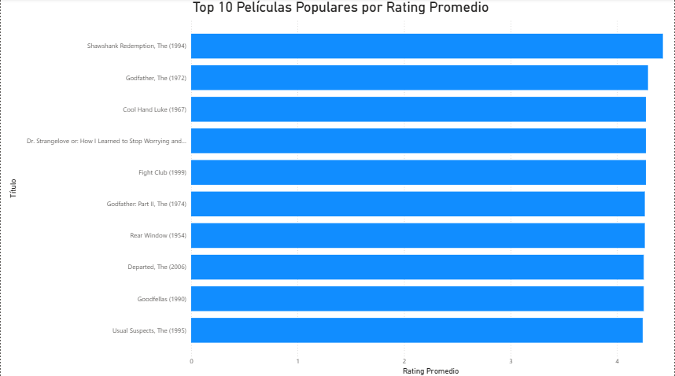
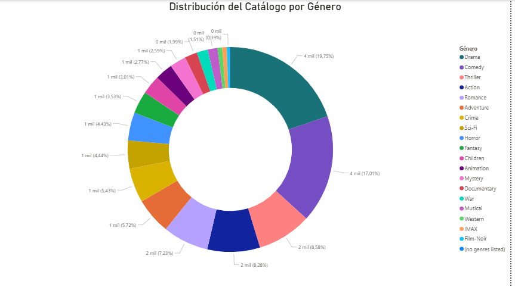
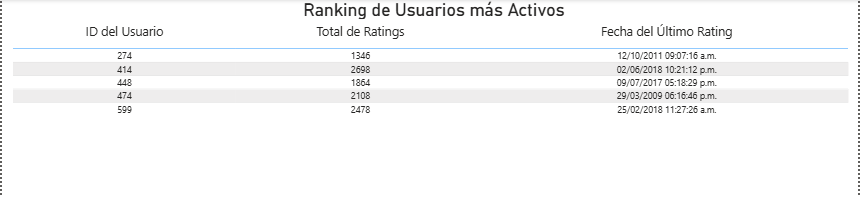
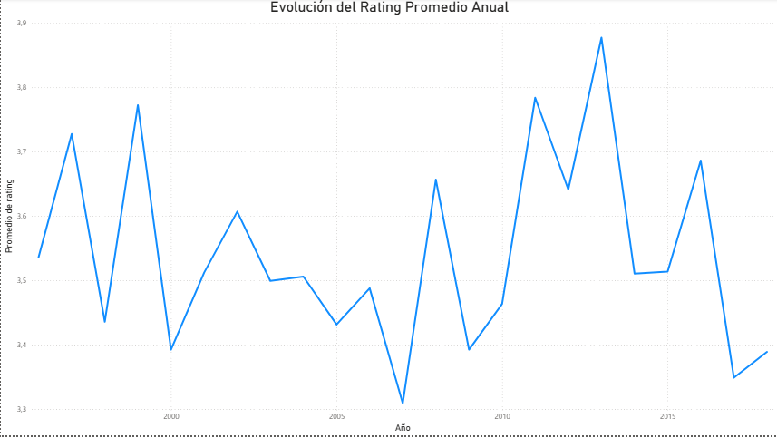
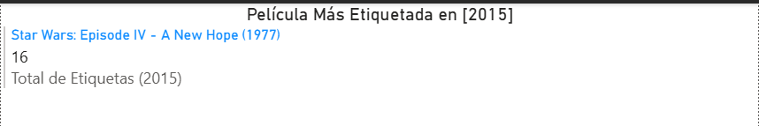

# Proyecto N°2: ETL y Análisis de Datos de Películas (MovieLens)

## Objetivos y Resumen Ejecutivo

Este proyecto implementa un proceso de Extracción, Transformación y Carga (ETL) utilizando Python y Pandas para procesar un *dataset* de más de 100,000 *ratings* y 3,600 películas (MovieLens). El objetivo es normalizar estos datos y cargarlos en una base de datos relacional PostgreSQL.

**Resumen Ejecutivo:**
* **ETL:** Script de Python (`peliculas.py`) que lee múltiples CSV, normaliza la relación N:M de géneros, transforma los *timestamps*, y carga los datos en PostgreSQL.
* **Modelado:** Se crea un esquema relacional con tablas para **Películas**, **Géneros**, **Ratings** y **Tags**.
* **BI:** Se desarrolla un *dashboard* en Power BI conectado a la base de datos para analizar tendencias de calificación y popularidad.

---

## Tecnologías Utilizadas

| Categoría | Tecnología | Uso Específico |
| :--- | :--- | :--- |
| **Lenguaje Principal** | Python 3.x | Lógica de ETL, limpieza y conexión a la base de datos. |
| **Librerías Python** | Pandas, Psycopg2, io | Manipulación de datos, conexión y carga masiva a PostgreSQL. |
| **Base de Datos** | PostgreSQL (pgAdmin) | Almacenamiento final de los datos transformados. |
| **Visualización** | Power BI | Creación del *dashboard* analítico y ejecución de consultas SQL clave. |
| **Control de Versiones**| Git / GitHub | Gestión del código fuente y del historial de cambios. |

---

## Resultados Clave y Visualizaciones

Las siguientes visualizaciones clave fueron creadas en Power BI, conectadas directamente a las tablas y consultas optimizadas en PostgreSQL (pgAdmin):

### 1. Top 10 Películas Populares por Rating Promedio
**Descripción:** Muestra las películas más consistentes y mejor valoradas.


### 2. Distribución del Catálogo por Género
**Descripción:** Determina el peso de cada género en el catálogo total.


### 3. Ranking de Usuarios más Activos
**Descripción:** Identifica a los contribuyentes principales de la plataforma.


### 4. Evolución del Rating Promedio Anual
**Descripción:** Analiza la tendencia histórica del promedio de calificaciones.


### 5. Película Más Etiquetada en 2015
**Descripción:** Muestra la película con mayor interacción por tags para un año específico.


---

## Metodología (Fases del Proyecto, Procedimiento)

El proyecto se dividió en tres fases principales:

### **Fase 1: Extracción y Transformación (Python)**

* **Extracción:** Carga de los archivos `movies.csv`, `ratings.csv` y `tags.csv`.
* **Limpieza/Transformación:**
    * Conversión de la columna `timestamp` en `ratings` y `tags` a formato `datetime`.
    * **Normalización de Géneros:** División de la columna `genres` en múltiples filas para crear las tablas `generos` y `peliculas_generos` (relación N:M).
    * Ajuste de nombres de columnas a minúsculas para compatibilidad con PostgreSQL.

### **Fase 2: Carga (PostgreSQL)**

* **Creación del Esquema:** Ejecución del script `Estructura_Proyecto2.sql` para crear la base de datos y las 5 tablas relacionales. 
* **Carga de Datos:** El script `peliculas.py` se conecta a PostgreSQL (usando `config.py` para credenciales) y utiliza `psycopg2` para la carga masiva (función `copy_from`) en el orden de dependencia de las tablas (Padres primero, Hijos después).

### **Fase 3: Análisis (Power BI)**

* Conexión directa a PostgreSQL y uso de las `Consultas_Proyecto2.sql` para generar las vistas necesarias para el *dashboard* (ej. Top 10 por Rating, Usuarios más Activos).

---

## Modelado de Datos (Esquema Relacional)

El esquema relacional fue diseñado con una estructura optimizada para análisis. A continuación, se muestra el diagrama del modelo:


### Tablas Creadas:

| Tabla | Propósito | Clave Primaria (PK) | Claves Foráneas (FK) |
| :--- | :--- | :--- | :--- |
| **peliculas** | Catálogo de películas. | `movieid` | N/A |
| **generos** | Lista única de categorías de género. | `genero_id` | N/A |
| **peliculas_generos**| Normaliza la relación M:M. | `(movieid, genero_id)` | `peliculas(movieid)`, `generos(genero_id)` |
| **ratings** | Almacena las calificaciones de los usuarios. | `(userid, movieid)` | `peliculas(movieid)` |
| **tags** | Almacena las etiquetas (tags) dadas por los usuarios. | `tag_id` (Serial) | `peliculas(movieid)` |

---

## Estructura del Archivo

Se utiliza una estructura modular para separar los recursos visuales, los archivos fuente (CSV) y el código.

```

.
└── Proyecto2_Peliculas_ETL/
├── peliculas.py              # Script principal de ETL
├── Estructura_Proyecto2.sql # Creación del esquema DB
├── Consultas_Proyecto2.sql # Consultas para BI (SQL)
├── Código_Adicional_Proyecto2.sql # Comandos de limpieza (TRUNCATE)
├── README.md                 # Documentación del proyecto
├── Citación.txt # Citación del Dataset
├── assets/                   # Recursos visuales del proyecto
|   ├── Proyecto2_Peliculas_Populares.png
|   ├── Proyecto2_Catalogo_Genero.png
|   ├── Proyecto2_Usuarios_Activos.png
|   ├── Proyecto2_Evolucion_Rating.png
|   ├── Proyecto2_Pelicula_Etiquetada.png
|   └── Proyecto2_Diagrama.png         # Diagrama del modelo relacional
├── data/                     # (IGNORADO) Archivos fuente CSV
|   ├── movies.csv
|   ├── ratings.csv
|   └── tags.csv
└── config.py                 # (IGNORADO) Credenciales de conexión

```

---

## Conclusiones

* **Normalización Exitosa:** Se demostró la capacidad de normalizar datos no estructurados (géneros concatenados) en un modelo relacional de Tercera Forma Normal (3NF) para optimizar las consultas.
* **Rendimiento de Carga:** El uso de la función `copy_from` de `psycopg2` garantiza una carga eficiente de grandes volúmenes de datos en PostgreSQL.
* **Insights:** El *dashboard* reveló una gran concentración de la actividad de *ratings* en un Top 5 de usuarios y destacó las preferencias de los usuarios por los géneros `Drama` y `Comedy`.

---

## Citación del Dataset

El *dataset* utilizado para este proyecto es el conjunto de datos **MovieLens**.

F. Maxwell Harper and Joseph A. Konstan. 2015. The MovieLens Datasets: History and Context. ACM Transactions on Interactive Intelligent Systems (TiiS) 5, 4: 19:1–19:19. https://doi.org/10.1145/2827872.

Descargado de https://grouplens.org/datasets/movielens/latest/

---
