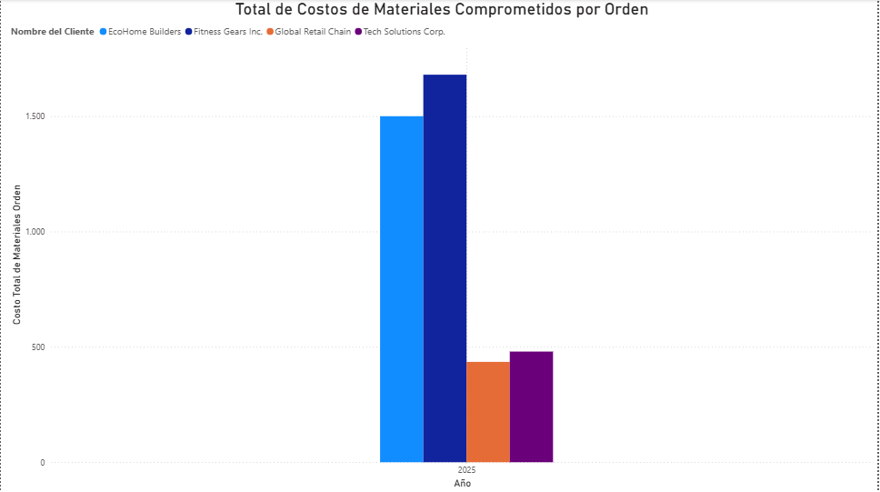

# Proyecto N°6: Dashboard de Business Intelligence con Power BI

## Objetivo del Proyecto
El objetivo de este proyecto es llevar las conclusiones de las consultas analíticas de SQL (Proyecto N°5) a un **dashboard visual y ejecutivo** utilizando Power BI. Este proyecto valida la capacidad de transformar datos brutos de la base de datos `manufactura_db` en información estratégica para la toma de decisiones gerenciales.

---

## Metodología y Conexión

La visualización se construyó conectando Power BI directamente al servidor de base de datos **PostgreSQL** para consumir los resultados de las consultas.

### Estructura del Esquema
El análisis se basa en el esquema relacional normalizado de la base de datos `manufactura_db`:


---

## Visualizaciones Clave

Las tres visualizaciones principales responden directamente a las necesidades de la gerencia de manufactura y demuestran el valor de un esquema normalizado:

### Costo Base de Materiales por Unidad de Producto (Roll-up)
Este gráfico de barras visualiza la métrica de costeo de materiales, un insumo clave para la fijación de precios:


* **Conclusión Clave:** La `Estructura Modular Acero` es, por mucho, el producto con el costo de material más alto, lo que dirige la atención a la optimización de la compra de su principal componente.

### Total de Costos de Materiales Comprometidos por Orden
Este gráfico de columnas muestra el costo total de materiales que la empresa debe invertir para cumplir con los pedidos:



* **Conclusión Clave:** La orden con el costo de materiales comprometido más alto corresponde a **EcoHome Builders** y **Fitness Gears Inc.**, identificando los pedidos que requieren la mayor inversión de capital.

### Volumen de Órdenes que Dependen de Cada Subcontratista
Este gráfico de anillo evalúa el riesgo en la cadena de suministro al cuantificar cuántas órdenes dependen de cada proveedor externo:


* **Conclusión Clave:** El análisis revela una dependencia crítica del proveedor **Componentes Eléctricos Z** (40% de las órdenes), un hallazgo vital para la gestión de riesgos y la negociación con proveedores.

---

## Estructura del Repositorio

```

proyecto_06_visualizacion_powerbi/
├── assets/
│   ├── manufactura_db_esquema.png      # Esquema de la Base de Datos manufactura_db
│   ├── costo_producto.png              # Gráfico 1: Costo Unitario
│   ├── costo_orden.png                 # Gráfico 2: Costo por Orden
│   └── dependencia_sc.png              # Gráfico 3: Dependencia de Subcontratistas
└── README.md                           # Documentación del proyecto

````

---