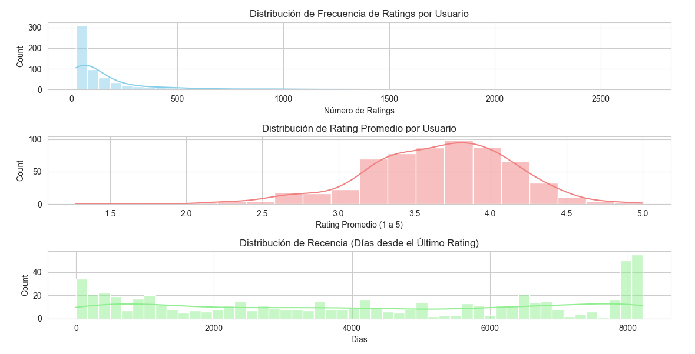
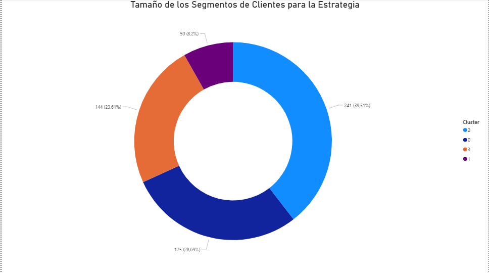
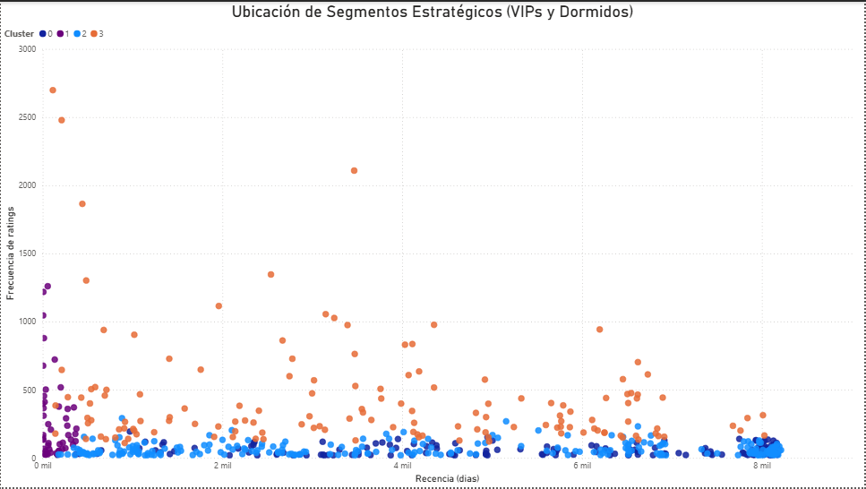

# Proyecto N°8: Análisis de Segmentación y Clustering (K-Means)

## Objetivo del Proyecto
Aplicación de **Clustering K-Means** sobre métricas **RFM** (Recencia, Frecuencia, Rating Promedio) para segmentar la base de usuarios de MovieLens, identificando cuatro perfiles de clientes accionables para estrategias de negocio específicas.

---

## Arquitectura de Data Science

### ETL y Feature Engineering (segmentacion.py)
* **Métricas Clave:** Frecuencia, Rating Promedio y Recencia (calculada a partir de la fecha máxima de rating).
* **Seguridad:** Uso de **`config.py`** para la gestión segura de credenciales.

### Análisis Exploratorio de Datos (EDA)
El EDA confirmó distribuciones **altamente sesgadas** en Frecuencia y Recencia, justificando la necesidad de transformación logarítmica.

* **Visualización:** Histograma de Distribuciones (`eda_segmentacion.py`).



### Machine Learning (transformacion_datos.py)
El clustering se realizó sobre datos transformados (Logarítmicos y Estandarizados).

* **Elección de K:** El **Método del Codo** validó la elección de **K=4** como el punto óptimo para el clustering.


* **Resultado:** El script exportó **`segmentacion_final_para_bi.csv`** con la etiqueta de `Cluster` para cada usuario.

---

## Visualización Ejecutiva (Power BI)

La narrativa de Power BI se centra en la distribución de la base de usuarios y la validación visual del modelo de segmentación.

### Gráfico 1: Distribución de Segmentos (Cuantificación)

* **Título:** **Tamaño de los Segmentos de Clientes para la Estrategia**
* **Visual:** Gráfico de Anillo (Donut Chart).



### Gráfico 2: Separación y Perfil Estratégico (Validación)

* **Título:** **Ubicación de Segmentos Estratégicos (VIPs y Dormidos)**
* **Visual:** Gráfico de Dispersión (Scatter Plot).
* **Análisis Clave:** La **clara separación de los cuatro grupos** de puntos valida la calidad del clustering.



---

## Estructura del Repositorio

```

Proyecto8_Segmentacion_usuarios/
├── assets/
│   ├── distribucion_eda.png            # Histograma de distribuciones (EDA)
│   ├── metodo_codo.png                 # Gráfico del Método del Codo (ML)
│   ├── distribucion_powerbi.png        # Gráfico (Anillo)
│   └── separacion_clusters_powerbi.png # Gráfico (Dispersión)
├── config.py                           # Credenciales DB (Buenas Prácticas) IGNORADO
├── segmentacion_usuarios.csv           # Output de SQL (Datos limpios) IGNORADO
├── segmentacion_final_para_bi.csv      # Output de ML (Con columna 'Cluster'), IGNORADO
├── segmentacion.py                     # ETL: SQL y Feature Engineering
├── eda_segmentacion.py                 # EDA: Visualización del sesgo
├── .gitignore                          # IGNORAMOS el archivo config.py y los archivos CSV
├── transformacion_datos.py             # ML: Log, Scaling, K-Means (K=4)
└── README.md                           # Documentación final

````

---
## Conclusiones

El análisis ha segmentado exitosamente a los usuarios en cuatro grupos con identidades de comportamiento claras. El **Gráfico de Dispersión** demuestra que los segmentos más críticos para el negocio (VIP y Dormido) se encuentran en cuadrantes bien diferenciados, permitiendo una acción de marketing precisa:
1.  **Retención:** Estrategias dirigidas al **Cluster VIP** (Cluster 1) para asegurar su lealtad y maximizar su valor a largo plazo.
2.  **Reactivación:** Campañas específicas para el **Cluster Dormido** (Cluster 0) con el objetivo de reducir la tasa de abandono.

---

## Citación del Dataset

El *dataset* utilizado para este proyecto es el conjunto de datos **MovieLens**.

F. Maxwell Harper and Joseph A. Konstan. 2015. The MovieLens Datasets: History and Context. ACM Transactions on Interactive Intelligent Systems (TiiS) 5, 4: 19:1–19:19. https://doi.org/10.1145/2827872.

Descargado de https://grouplens.org/datasets/movielens/latest/

---

# Project N°8: Segmentation and Clustering Analysis (K-Means)

## 1.Project Objective

Application of K-Means clustering to RFM metrics (Recency, Frequency, Average Rating) to segment the MovieLens user base, identifying four actionable customer profiles for specific business strategies.

---

## 2. Data Science Architecture

### ETL and Feature Engineering (`segmentation.py`)
* **Key Metrics**: Frequency, Average Rating, and Recency (calculated from the highest rating date).
* **Security**: Use of `config.py` for secure credential management.

### Exploratory Data Analysis (EDA)
EDA confirmed highly skewed distributions in Frequency and Recency, justifying the need for logarithmic transformation.

* **Visualization**: Distribution Histogram (`eda_segmentation.py`).


### Machine Learning (`transformation_data.py`)
Clustering was performed on transformed data (logarithmic and standardized).

* **K Selection**: The Elbow Method validated the selection of **K=4** as the optimal point for clustering.


* **Result**: The script exported `segmentacion_final_para_bi.csv` with the Cluster label for each user.

---

## 3. Executive Visualization (Power BI)

The Power BI narrative focuses on the distribution of the user base and the visual validation of the segmentation model.

### Chart 1: Segment Distribution (Quantification)

* **Title**: Customer Segment Size for the Strategy
* **Visual**: Donut Chart


### Chart 2: Separation and Strategic Profile (Validation)

* **Title**: Location of Strategic Segments (VIPs and Dormant Segments)
* **Visual**: Scatter Plot
* **Key Analysis**: The clear separation of the four groups of points validates the quality of the clustering.


---

## 4. Repository Structure

```bash
Proyecto8_Segmentacion_usuarios/
├── assets/
│   ├── distribucion_eda.png    # Distribution Histogram (EDA)
│   ├── metodo_codo.png         # Elbow Method (ML) Chart
│   ├── distribucion_powerbi.png   # Ring Chart
│   └── separacion_clusters_powerbi.png # Scatter Chart
├── config.py # DB Credentials (Best Practices) IGNORED
├── segmentacion_usuarios.csv   # SQL Output (Clean Data) IGNORED
├── segmentacion_final_para_bi.csv  # ML Output (With 'Cluster' column), IGNORED
├── segmentacion.py # ETL: SQL and Feature Engineering
├── eda_segmentacion.py # EDA: Bias Visualization
├── .gitignore # IGNORE the config.py file and the CSV files
├── transformacion_datos.py  # ML: Log, Scaling, K-Means (K=4)
└── README.md # Final documentation
```

---

## 5. Conclusions

The analysis has successfully segmented users into four groups with clear behavioral identities. The scatter plot demonstrates that the most critical segments for the business (VIP and Dormant) are located in clearly differentiated quadrants, allowing for precise marketing action:

1. **Retention**: Strategies targeting the VIP Cluster (Cluster 1) to ensure their loyalty and maximize their long-term value.
2. **Reactivation**: Specific campaigns for the Dormant Cluster (Cluster 0) with the goal of reducing churn.

---

## 6. Dataset Citation

The dataset used for this project is the MovieLens dataset.

F. Maxwell Harper and Joseph A. Konstan. 2015. The MovieLens Datasets: History and Context. ACM Transactions on Interactive Intelligent Systems (TiiS) 5, 4: 19:1–19:19. https://doi.org/10.1145/2827872.

Downloaded from https://grouplens.org/datasets/movielens/latest/

---
