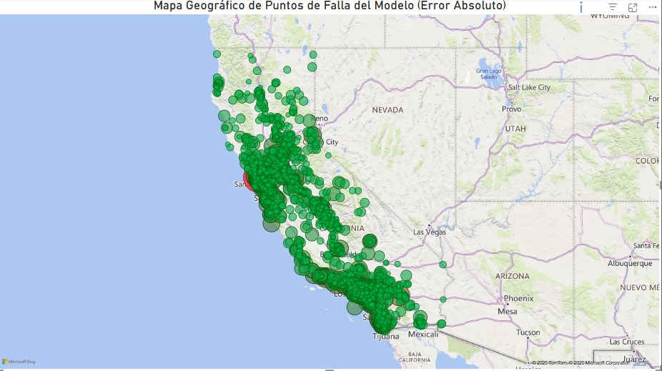
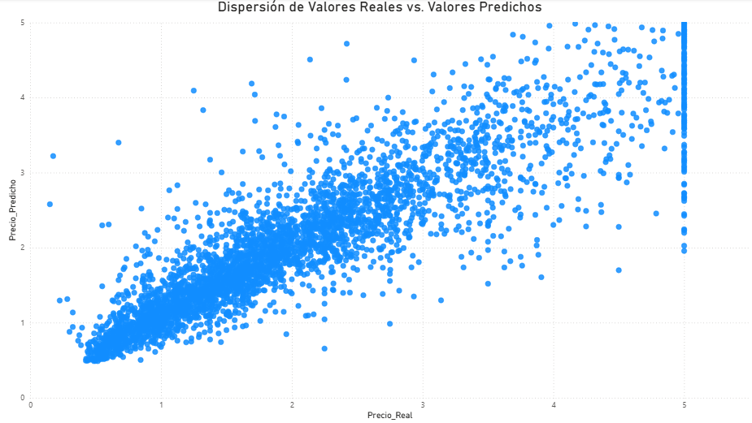

# Proyecto N°9: Predicción de Valor de Viviendas (Regresión)
---
## **Implementación y Validación de un Modelo de Regresión para Predecir el Valor Mediano de Viviendas en California.**

---

## Objetivos y Resumen Ejecutivo

### Objetivo del Proyecto
El objetivo central fue construir y validar un modelo de Regresión para el dataset de Viviendas de California, enfocándose en la obtención de un alto rendimiento (R² Score) y la generación de un output de datos limpio para el análisis de Business Intelligence.

### Resumen Ejecutivo
El proyecto ha finalizado con la implementación de un **Random Forest Regressor** en Python. El modelo alcanzó un **R² Score de 0.803**, demostrando una alta capacidad para predecir los valores inmobiliarios. La validación exhaustiva de los resultados mediante visualizaciones de BI confirma la solidez metodológica y estadística.

---

## Arquitectura de Data Science

La arquitectura se divide en tres fases principales: Adquisición y EDA, Modelado y Validación, y Generación de Output para BI.

### ETL, EDA y Feature Engineering
* **Adquisición:** El script `housing.py` se encarga de cargar el dataset nativo de Scikit-learn.
* **Análisis Exploratorio de Datos (EDA):** Se analizó la correlación de las variables y la distribución geográfica de los precios (`eda_regresion.py`).
* **Feature Engineering:** Se aplicó la división Train/Test y la **Estandarización** de las variables predictoras.

#### Visualizaciones Clave de EDA
* **Gráfico 1: Matriz de Correlación**

    * **Análisis:** Confirma que el **Ingreso Mediano (`MedInc`)** es el predictor con mayor correlación positiva.
* **Gráfico 2: Dispersión Geográfica**

    * **Análisis:** Visualiza la concentración de precios altos cerca de la costa, crucial para la justificación del modelo.

### Machine Learning (modelado_regresion2.py)
* **Algoritmo:** **Random Forest Regressor**.
* **Métrica:** **R² Score** (80.3% de la varianza explicada).

### Generación de Output para Power BI
* El script `modelado_regresion2.py` exporta el archivo `predicciones_viviendas_bi_FINAL_CORREGIDO.csv`, listo para la ingesta en BI.

---

## Resultados de Validación y Visualizaciones

La validación se realizó sobre el conjunto de prueba, utilizando Power BI para una mejor interpretabilidad de los resultados.

### Métricas Finales
| Métrica | Valor | Interpretación |
| :--- | :--- | :--- |
| **R^2 Score** | 0.803 | La varianza en el valor de las viviendas se explica en un 80.3% por el modelo. |

### Visualizaciones de Validación (Power BI)

#### Gráfico 1: Mapa Geográfico de Errores
El mapa permite ver la identificación geográfica de las áreas de mayor imprecisión en la predicción.



#### Gráfico 2: Curva de Predicción vs. Realidad
La curva confirma visualmente la alta alineación del modelo con la línea de *y=x*, validando el alto *R^2*.


#### Gráfico 3: Histograma de Error Absoluto
El histograma muestra una **Distribución Sesgada a la Derecha**, con el pico concentrado en los valores más cercanos a cero. Esta forma confirma que la mayoría de los errores son mínimos y que el modelo es estadísticamente robusto.


---

## Estructura del Repositorio

El repositorio sigue la siguiente estructura de directorios:

```

Proyecto9_Predicciones_viviendas_California
├── .gitignore                      # Archivo de configuración.
├── housing.py                      # Script de Adquisición de datos.
├── eda_regresion.py                # Script de EDA y Matplotlib.
├── modelado_regresion2.py          # Script de Modelado y exportación final.
├── predicciones_viviendas_bi_FINAL_CORREGIDO.csv  # Output de datos final.
├── assets/                         # Carpeta de recursos visuales
│   ├── Heatmap_Correlacion.png
│   ├── Distribucion_Vivienda.png
│   ├── Mapa_California.png
│   ├── Dispersion_Valores.png
│   └── Distribucion_Frecuencia.png
└── README.md                       # Documentación principal.

```

---

## Conclusiones

El Proyecto N°9 ha finalizado con éxito, entregando un modelo de regresión con alto rendimiento. El artefacto de datos es apto para su ingesta directa en el área de BI, y la validación visual confirma la calidad y la interpretabilidad de las predicciones del modelo.

---
