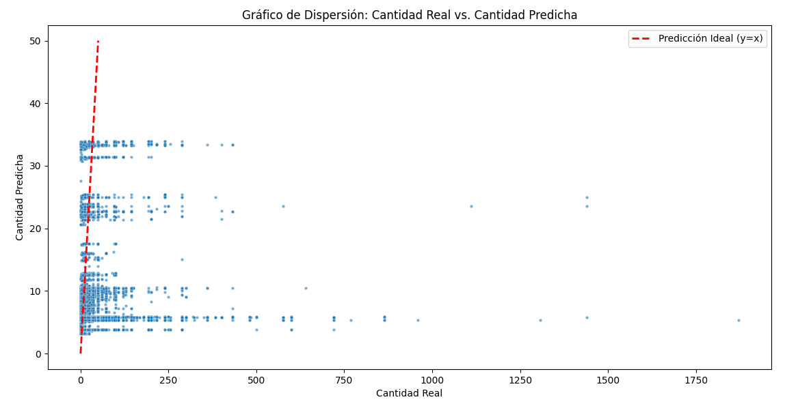
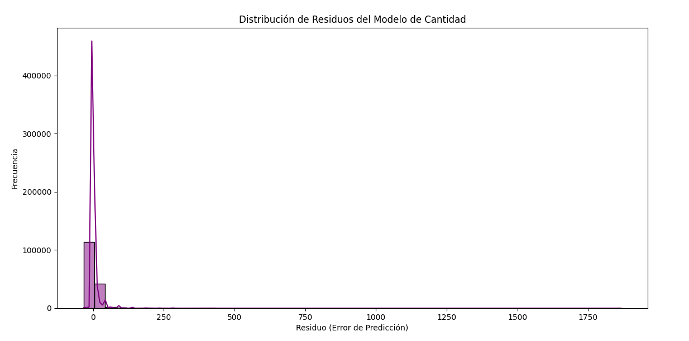
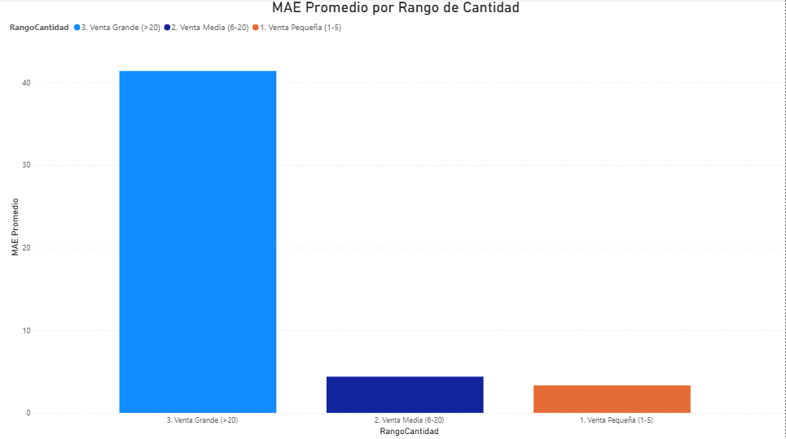
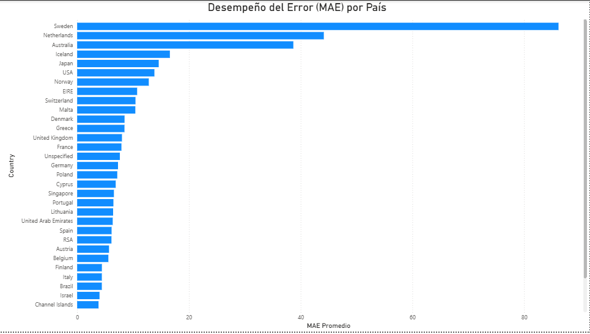

# Proyecto N°12 - Predicción de Cantidad de Ventas de E-commerce

## Objetivos y Resumen Ejecutivo

Este proyecto tiene como objetivo principal construir un *pipeline* de análisis predictivo completo, desde la ingesta de datos brutos hasta la visualización ejecutiva del error del modelo.

El corazón del proyecto es la implementación de un modelo de **Regresión Logarítmica** para predecir la variable crítica de negocio: la **Cantidad** de productos vendidos por transacción (`Quantity`).

### Conclusiones Ejecutivas

* **Modelo Final:** Se implementó un modelo de Regresión Lineal con transformación Logarítmica en la variable dependiente (`Quantity`).

* **Diagnóstico de Error (Heterocedasticidad):** El error de predicción es **diez veces mayor** para las transacciones de *Venta Grande* (>20 unidades) que para las *Ventas Pequeñas* (1-5 unidades). El modelo es inconsistente y solo es confiable para estimar volúmenes bajos.

* **Sesgo Geográfico:** El modelo es ineficiente y registra un Error Absoluto Medio (MAE) extremadamente alto en **Suecia (Sweden)**, sugiriendo un patrón de compra atípico en esa región que el modelo general no puede capturar.

---

## Tecnologías Utilizadas

| Categoría | Herramientas y Lenguajes | Propósito |
| :--- | :--- | :--- |
| **Ingesta y Procesamiento** | Python, Pandas, NumPy | Limpieza, *Feature Engineering* y transformación de datos. |
| **Machine Learning** | Scikit-learn (Linear Regression) | Creación y entrenamiento del modelo predictivo. |
| **Persistencia de Datos** | PostgreSQL, `psycopg2` | Almacenamiento seguro del dataset limpio y de las predicciones. |
| **Visualización Ejecutiva** | Power BI, DAX | Análisis de error post-predicción para conclusiones de negocio. |
| **Seguridad** | `.gitignore`, `config.py` | Gestión segura de credenciales de base de datos. |

---

## Resultados Clave y Visualizaciones

Las principales conclusiones provienen del análisis de los residuos del modelo de Regresión Logarítmica.

### Gráficos Matplotlib: Predicción y Distribución de Residuos

* **Archivos:** `assets/dispersion_cantidad.png` y `assets/residuos_cantidad.png`
* **Propósito:** Confirmar visualmente la alineación general de las predicciones y la distribución de los errores generados en Python.




### Gráfico Power BI 1: Diagnóstico del Modelo

**Título:** **MAE Promedio por Rango de Cantidad**

Este gráfico confirma la **Heterocedasticidad**. La barra de `Venta Grande` muestra que el error se dispara en las transacciones de alto valor, un punto débil crítico del modelo.



### Gráfico Power BI 2: Sesgo Geográfico

**Título:** **Desempeño del Error (MAE) por País**

Este gráfico de barras horizontales revela que el MAE en **Suecia** es anormalmente alto, sugiriendo que las características de venta en ese país no se ajustan al modelo global.



---

## Procedimiento y Metodología

El proyecto se ejecutó siguiendo un *pipeline* de **4 Fases**:

1.  **FASE 1: Limpieza y *Feature Engineering***: Carga del CSV, limpieza de valores nulos y atípicos, y creación de variables categóricas (ej. `DiaSemana`) y numéricas (ej. `ValorTotal`).
2.  **FASE 2: Persistencia Segura**: Uso de `config.py` y el método `copy_from` de `psycopg2` para realizar la carga masiva (CRUD) y segura del dataset limpio (`retail_clean`) en PostgreSQL.
3.  **FASE 3: Modelado (Regresión Logarítmica)**: Aplicación de la transformación logarítmica (`np.log1p`) a la variable dependiente `Quantity` para mitigar la asimetría, entrenamiento del modelo de Regresión Lineal y reversión de la transformación (`np.expm1`) para la predicción final.
4.  **FASE 4: Exportación y Visualización Ejecutiva**: Generación del archivo `ecommerce_predicciones_bi.csv` con las predicciones y los residuos, y análisis detallado en Power BI.

---

## Estructura del Proyecto

```
Proyecto_12_Predicciones_ecommerce/
├── assets/
│   ├── dispersion_cantidad.png    
│   ├── residuos_cantidad.png     
│   ├── MAE_rango.png             
│   └── MAE_pais.png              
├── config.py                     # Credenciales seguras para PostgreSQL
├── citacion.txt                  # Archivo de citación del dataset
├── .gitignore                    # Ignora archivos sensibles (config.py) y grandes (datasets)
├── online_retail.csv             # Dataset original
├── ecommerce_base.sql            # Definición de la base de datos (DB) y la tabla (DDL)
├── ecommerce.py                  # Script principal (Limpieza, ML, Persistencia, Exportación)
├── ecommerce_predicciones_bi.csv # Datos de salida con predicciones y residuos para BI
└── README.md                     # Documentación del proyecto
```

---

## Conclusiones

El proyecto demostró la capacidad de construir un *pipeline* predictivo completo. El uso de la **Regresión Logarítmica** mejoró la métrica global y el MAE para la mayoría de los datos, pero las visualizaciones en Power BI revelaron que el modelo sigue siendo vulnerable a la **Heterocedasticidad** (ventas grandes) y al **Sesgo Geográfico** (Suecia). Las futuras mejoras deberían enfocarse en modelos más robustos (ej. Random Forest) o en la segmentación del modelo por país.

---

## Citación del Dataset

El dataset utilizado en este proyecto es:

> UCI Machine Learning Repository. (2020). Online Retail II. Obtenido de https://www.kaggle.com/datasets/mashlyn/online-retail-ii-uci
