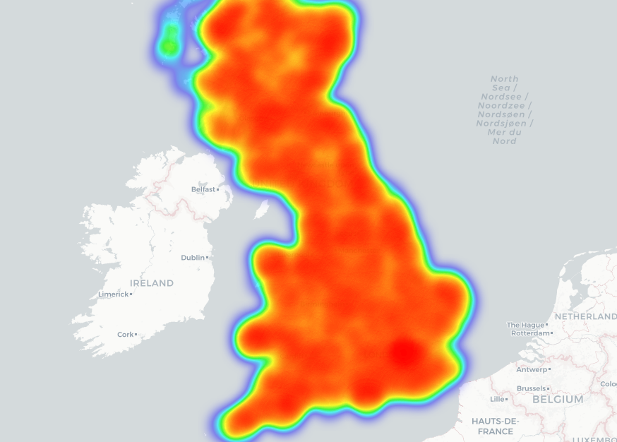
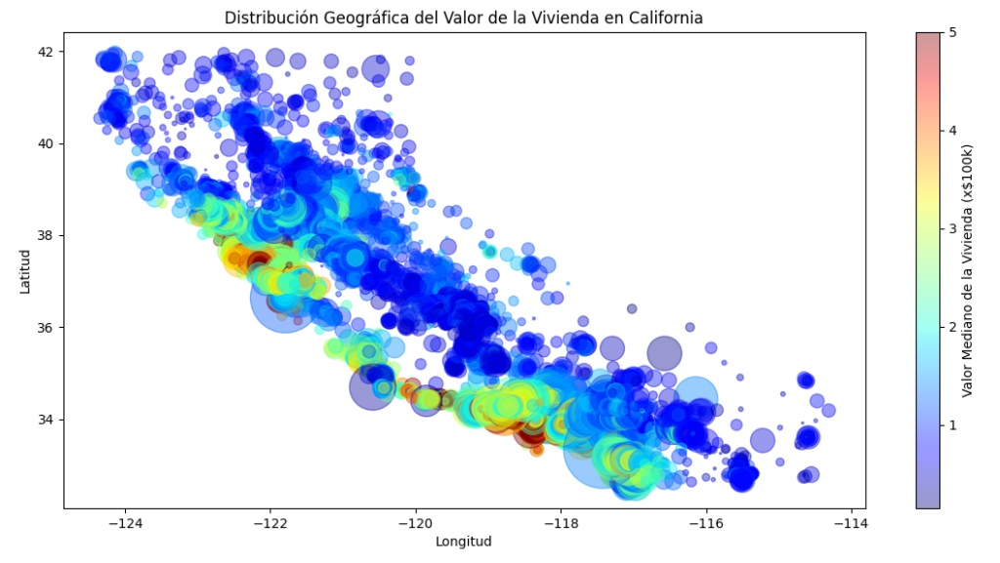

## **Portafolio Profesional de Data Science y Análisis Avanzado** (Español)

### **Introducción**

Este repositorio es un portafolio de proyectos de Data Science que demuestra experiencia *end-to-end* en el ciclo de vida de los datos: **Ingeniería de Datos (SQL/PostgreSQL)**, **Análisis de Negocio (BI/Power BI)** y **Machine Learning (Modelado Supervisado/No Supervisado, NLP)**. Los proyectos se centran en la traducción de datos brutos a inteligencia de negocio y en la implementación de soluciones predictivas robustas, con un fuerte enfoque en el **diagnóstico de error** y el **valor ejecutivo**.

---

### **1. Resumen Ejecutivo**

| Dominio | Habilidades Clave y Demostración | Proyectos de Referencia |
| --- | --- | --- |
| **Ingeniería de Datos y DB** | Diseño de esquemas en Tercera Forma Normal (3NF), ETL con Python (`psycopg2` y carga masiva), Aplicación de Funciones de Ventana SQL y CTEs. | Proyectos de Manufactura y ETL |
| **Machine Learning** | Modelado de Regresión (Random Forest, Logarítmica), Clustering (K-Means), Clasificación y Vectorización NLP (Tf-idf). | Proyectos de Segmentación, Predicciones y Sentimientos |
| **Análisis de Negocio (BI)** | Análisis de Cohortes, Segmentación RFM, Creación de *Dashboards* Ejecutivos y Diagnóstico avanzado de Error de Modelos (Heterocedasticidad, Sesgo Geográfico). | Proyectos de RFM, Cohortes y E-commerce |
| **Análisis Especializado** | Series de Tiempo (Tendencia y Estacionalidad) y Análisis Geoespacial (Folium/Mapas de Calor, Riesgo Temporal). | Proyectos de Series de Tiempo y Geoespacial |

---

### **2. Tecnologías Utilizadas**

El *stack* tecnológico demuestra familiaridad con herramientas esenciales para la producción y el análisis avanzado:

* **Lenguajes:** **Python** (Dominio), **SQL** (PostgreSQL).
* **Bibliotecas Centrales:** Pandas, NumPy, Scikit-learn, NLTK, Psycopg2.
* **Bases de Datos:** PostgreSQL.
* **Visualización y BI:** Power BI, Matplotlib, Seaborn, Folium.
* **Metodología:** Gestión segura de credenciales (`config.py`), Normalización 3NF, Modelado de Relación M:N.

---

### **3. Proyectos Agrupados por Dominio (12 Proyectos)**

#### **A. Ingeniería de Datos y Bases de Datos (SQL/ETL)**

* **Proyecto N°4:** Diseño y Normalización de Esquema para Manufactura (3NF, Modelado BOM).
* **Proyecto N°5:** Implementación y Consultas Analíticas Avanzadas (SQL) para costeo y riesgo de suministro.
* **Proyecto N°2:** ETL y Análisis de Datos de Películas (Carga Masiva con `psycopg2`).

#### **B. Machine Learning y Modelado Predictivo**

* **Proyecto N°12:** Predicción de Cantidad de Ventas de E-commerce con diagnóstico de **Heterocedasticidad y Sesgo Geográfico**.
* **Proyecto N°9:** Predicción de Valor de Viviendas (Regresión con Random Forest), alto R^2 Score.
* **Proyecto N°8:** Análisis de Segmentación y Clustering (K-Means) sobre métricas RFM.
* **Proyecto N°11:** Análisis de Sentimientos en Reseñas (NLP) usando Tf-idf y Clasificación.

#### **C. Business Intelligence y Análisis de Negocio**

* **Proyecto N°6:** Dashboard de Business Intelligence con Power BI para decisiones ejecutivas de Manufactura.
* **Proyecto N°3:** Análisis de Retención y Valor de Usuario por Cohortes.
* **Proyecto N°1:** Análisis de Segmentación de Clientes (RFM clásico).

#### **D. Análisis Especializado (Series de Tiempo y Geoespacial)**

* **Proyecto N°7:** Análisis de Series de Tiempo y Tendencias (Funciones de Ventana SQL y Curva de Crecimiento).
* **Proyecto N°10:** Análisis Geoespacial de Accidentes de Tráfico (Folium/HeatMaps) e identificación de riesgo horario.

---

### 4. Visualizaciones de Ejemplo
Para ejemplificar nuestro portafolio, veremos aquí cuatro imágenes, procedentes de diferentes proyectos, para ilustrar el uso de diferentes herramientas de visualización.

En primer lugar, tenemos aquí el Diagrama del esquema de la base de datos `manufactura_db`, procedente del **Proyecto N°6: Dashboard de Business Intelligence con Power BI**. El Diagrama fue realizado con **DBeaver**, luego de haberse conectado con **pgAdmin**.

Por otro lado, en la mayoría de los trabajos utilizamos la herramienta **Power BI** para visualizar y comunicar los principales *insights* de nuestro proyecto. En este caso, nos dirigiremos al **Proyecto N°11: Análisis de Sentimientos en Reseñas de Películas**, y veremos el siguiente gráfico de anillo, titulado **Distribución Final de Sentimientos Predichos**, en el que se observa un balance casi perfecto, en el que ambos grupos están separados por sus respectivos colores (verde y rojo).

Asimismo, en el **Proyecto N°10: Análisis Geoespacial de Accidentes de Tráfico en el Reino Unido**, trabajamos con la biblioteca **Folium** para generar dos mapas que representan la gravedad de los accidentes en la región. Esta imagen, la cual representa la mirada general de los accidentes, está tomada del archivo HTML adjuntado en la carpeta del proyecto.

Por último, también trabajamos con la biblioteca estándar de visualización para Python, **Matplotlib**. En el **Proyecto N°9: Predicción de Valor de Viviendas**, utilizamos la herramienta para visualizar la distribución geográfica del valor de la vivienda en California. Como resultado, podemos observar la concentración de precios altos cerca de la costa de la región.

---

### **5. Cómo Usar el Repositorio**

1. **Clonar el Repositorio:** Utiliza el comando `git clone` estándar y la URL del repositorio.
2. **Archivos de Datos y Configuración:** Debido al uso de archivos `.gitignore` en cada subdirectorio, el repositorio NO contiene los datasets originales (CSV) ni el archivo de credenciales `config.py`.
* **Acción Requerida**: Para ejecutar los scripts, el usuario debe obtener los datasets citados en el `README.md` de cada proyecto y crear un archivo `config.py` con sus propias credenciales de PostgreSQL.
3. **Ejecución de Scripts:** Instala las dependencias de Python (listadas en el `README.md` de cada proyecto). Ejecuta el script principal de cada proyecto (ej. el script del Proyecto 12 es `python ecommerce.py`).
4. **Visualización y Análisis (Power BI):** El resultado de los scripts (archivos `.csv` de salida o la tabla final de PostgreSQL) se usa como fuente de datos para la generación de los *dashboards* de Power BI.

---

### **6. Licencia**

Este proyecto está bajo la licencia **MIT**. Eres libre de usar, modificar y distribuir el código con la atribución adecuada, **siempre y cuando se cite al autor original del repositorio.**

---

## **Data Science and Advanced Analytics Professional Portfolio** (English)

### **Introduction**

This repository is a portfolio of Data Science projects demonstrating end-to-end expertise in the data lifecycle: **Data Engineering (SQL/PostgreSQL)**, **Business Analytics (BI/Power BI)**, and **Machine Learning (Supervised/Unsupervised Modeling, NLP)**. The projects focus on translating raw data into business intelligence and implementing robust predictive solutions, with a strong emphasis on **error diagnosis** and **executive value**.

---

### **1. Executive Summary**

|Field | Key Skills and Demonstration | Projects |
| --- | --- | --- |
| **Data Engineering and Databases** | Third Normal Form (3NF) schema design, ETL with Python (`psycopg2` and bulk loading), Use of SQL Window Functions and CTEs | Manufacturing and ETL Projects |
| **Machine Learning** | Regression Modeling (Random Forest, Logarithmic), Clustering (K-Means), Classification and Vectorization, NLP (TF-IDF) | Segmentation, Prediction, and Sentiment Projects |
| **Business Intelligence (BI)** Analysis | Cohort Analysis, RFM Segmentation, Executive Dashboard Creation, and Advanced Model Error Diagnostics (Heteroscedasticity, Geographic Bias) | RFM, Cohort, and E-commerce Projects |
| **Specialized Analysis** | Time Series (Trend and Seasonality) and Geospatial Analysis (Folium/Heat Maps, Temporal Risk) | Time Series and Geospatial Projects

---

### **2. Tools and Languages**

This portfolio demonstrates familiarity with essential tools for production and advanced analysis:

* **Languages**: **Python**, **SQL** (PostgreSQL).
* **Core Libraries**: Pandas, NumPy, Scikit-learn, NLTK, Psycopg2.
* **Databases**: PostgreSQL.
* **Visualization and BI**: Power BI, Matplotlib, Seaborn, Folium.
* **Methodology**: Secure credential management (`config.py`), 3NF normalization, M:N relationship modeling.

---

### **3. Projects Grouped by Domain (12 Projects)**

#### **A. Data Engineering and Databases (SQL/ETL)**

* **Project N°4**: Schema Design and Normalization for Manufacturing (3NF, BOM Modeling).
* **Project N°5**: Implementation and Advanced Analytical Queries (SQL) for costing and supply risk.
* **Project N°2**: ETL and Data Analysis of Films (Bulk Load with `psycopg2`).

#### **B. Machine Learning and Predictive Modeling**

* **Project N°12**: E-commerce Sales Volume Prediction with Heteroscedasticity and Geographic Bias Analysis.
* **Project N°9**: Housing Value Prediction (Regression with Random Forest), high R² score.
* **Project N°8**: Segmentation and Clustering Analysis (K-Means) on RFM Metrics.
* **Project N°11**: Sentiment Analysis in Reviews (NLP) using TF-IDF and Classification.

#### **C. Business Intelligence and Business Analytics**

* **Project N°6**: Business Intelligence Dashboard with Power BI for Manufacturing Executive Decisions.
* **Project N°3**: User Value and Retention Analysis by Cohort.
* **Project N°1**: Customer Segmentation Analysis (Classic RFM).

#### **D. Specialized Analysis (Time Series and Geospatial)**

* **Project N°7**: Time Series and Trend Analysis (SQL Window Functions and Growth Curve).
* **Project N°10**: Geospatial Analysis of Traffic Accidents (Folium/HeatMaps) and Identification of Hourly Risk.

---

## 4. Example Visualizations
To illustrate our portfolio, we'll take a look at four images from different projects to demonstrate the use of various visualization tools.

First, we have the schema diagram for the `manufactura_db` database, from **Project N°6: Business Intelligence Dashboard with Power BI**. The diagram was created using **DBeaver** after connecting to **pgAdmin**.

On the other hand, in most of our projects we use the **Power BI** tool to visualize and communicate the main *insights* of our work. In this case, we will look at **Project N°11: Sentiment Analysis in Movie Reviews**, and we will see the following pie chart, titled **Final Distribution of Predicted Sentiments**, which shows an almost perfect balance, with both groups separated by their respective colors (green and red).

Similarly, in **Project N°10: Geospatial Analysis of Traffic Accidents in the United Kingdom**, we used the **Folium** library to generate two maps representing the severity of accidents in the region. This image, which provides an overview of the accidents, is taken from the HTML file included in the project folder.

Finally, we also worked with the standard visualization library for Python, **Matplotlib**. In **Project N°9: Home Value Prediction**, we used the tool to visualize the geographic distribution of home values ​​in California. As a result, we can observe the concentration of high prices near the region's coast.

---

### **5. How to Use the Repository**

1. **Clone the Repository**: Use the standard `git clone` command and the repository URL.
2. **Setup and Data Files**: Due to the use of `.gitignore` files in each subdirectory, the repository does NOT contain the original datasets (CSV) or the `config.py` credentials file.
* **Required Action**: To run the scripts, the user must obtain the datasets listed in the README.md file for each project and create a `config.py` file with their own PostgreSQL credentials.
3. **Running Scripts**: Install the Python dependencies (listed in the README.md file for each project). Run the main script for each project (e.g., the script for Project 12 is `python ecommerce.py`).
4. **Visualization and Analysis (Power BI)**: The output of the scripts (output `.csv` files or the final PostgreSQL table) is used as the data source for generating Power BI dashboards.

---

### **6. License**

This project is licensed under the MIT License. You are free to use, modify, and distribute the code with proper attribution, provided you cite the original author of the repository.

---
