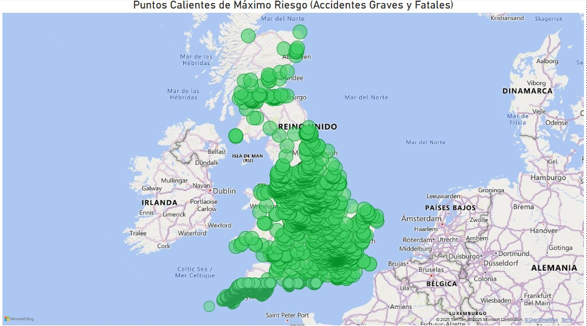
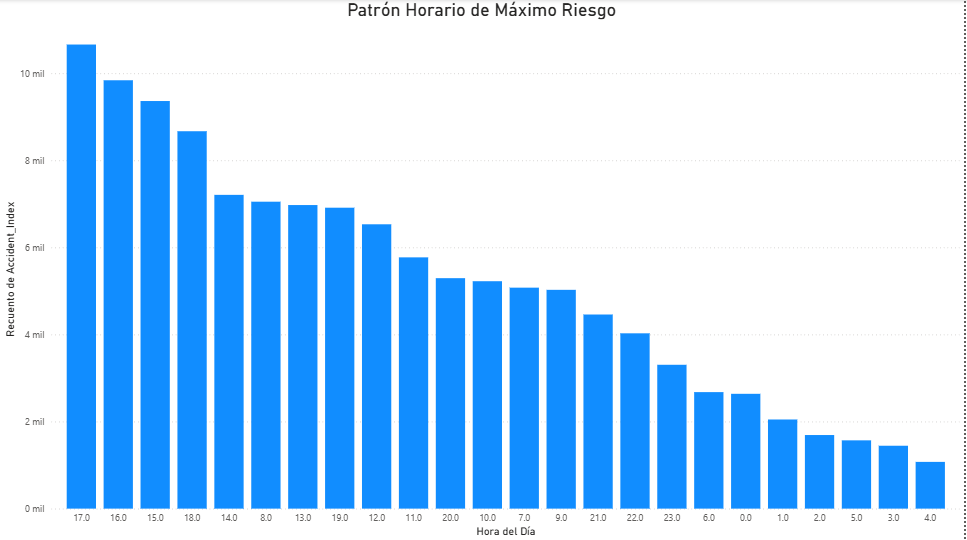

# Proyecto N°10: Análisis Geoespacial de Accidentes de Tráfico en el Reino Unido

## Título del Proyecto
**Análisis Geoespacial y Temporal de Riesgo de Accidentes de Tráfico en el Reino Unido: Identificación de Zonas Calientes y Patrones Horarios.**

---

## Objetivos y Resumen Ejecutivo

### Objetivo del Proyecto
El objetivo principal fue realizar una limpieza robusta de un dataset geoespacial (Accidentes de Tráfico en UK), transformando las coordenadas y la severidad en información accionable para identificar los patrones de riesgo espacial y temporal.

### Resumen Ejecutivo
El proyecto ha concluido con la limpieza exitosa de **1,910,000** registros geoespaciales y la generación de un modelo de datos apto para Business Intelligence. El análisis reveló que el **máximo riesgo de incidentes graves se concentra entre las 15:00 y las 18:00**, y los puntos calientes de riesgo fatal se ubican en carreteras y cruces específicos fuera de las áreas de mayor densidad de tráfico.

---

## Tecnologías Utilizadas
* **Lenguaje:** Python 3.x
* **Librerías Clave:**
    * **Pandas / NumPy:** Carga, limpieza, filtrado geoespacial y corrección de tipos.
    * **Folium / HeatMap:** Generación de mapas de calor estáticos (artefactos de código).
* **Plataforma de Visualización:** Microsoft Power BI.

---

## Resultados Clave y Visualizaciones

### Limpieza y Transformación de Datos
* **Registros Iniciales:** 2,000,000
* **Registros Finales Limpios:** 1,910,000 (Pérdida del 4.5% de registros no válidos o incompletos).
* **Transformaciones:** Mapeo de Severidad (Texto a Número), Creación de `Hour_of_Day`, y Filtrado de Coordenadas fuera de UK.

### Visualizaciones Clave

#### Mapa 1: Concentración Geográfica de Incidentes de Tráfico en UK
Muestra el volumen total de accidentes, confirmando que la densidad se concentra en las grandes áreas metropolitanas.


#### Mapa 2: Puntos Calientes de Máximo Riesgo (Accidentes Graves y Fatales)
Aísla solo los accidentes de Severidad Fatal y Grave (1 y 2). Este mapa revela los *hotspots* críticos de riesgo, que no siempre coinciden con la mayor densidad de tráfico.


#### Gráfico 3: Patrón Horario de Máximo Riesgo: Picos entre 15:00 y 18:00
Identifica el factor tiempo. La concentración de la mayoría de los incidentes en la hora pico vespertina es un hallazgo clave para la planificación de recursos de seguridad vial.


---

## Procedimiento y Ejecución

1.  **Carga y Selección:** Carga del dataset `Accidents.csv` seleccionando las columnas clave (`accidents2.py`).
2.  **Limpieza Crítica:** Corrección de tipos, eliminación de nulos y **filtrado geoespacial** estricto para coordenadas (`Latitude` y `Longitude`) fuera de los límites del Reino Unido.
3.  **Transformación:** Creación de la columna `Hour_of_Day` y mapeo numérico de `Accident_Severity`.
4.  **Generación de Artefactos:** Creación de los mapas estáticos de Folium (`01_accidents_heatmap_general.html` y `02_accidents_heatmap_graves.html`).
5.  **Exportación:** Generación de `accidentes_uk_limpio_para_bi_final.csv` para la ingesta en Power BI.
6.  **Análisis BI:** Creación de los visuales de validación (Gráficos 1, 2 y 3).

---

## Estructura de los Archivos

El repositorio sigue la siguiente estructura de directorios:

```

proyecto10_analisis_geoespacial
├── .gitignore                      # Ignora el CSV de salida.
├── accidents2.py                   # Script principal de Ingeniería de Datos y Folium.
├── Accidents.csv                   # Dataset original (entrada).
├── accidentes_uk_limpio_para_bi_final.csv # Output de datos limpio para BI (salida).
├── 01_accidents_heatmap_general.html # Mapa estático de Folium (General).
├── 02_accidents_heatmap_graves.html  # Mapa estático de Folium (Graves/Fatales).
├── assets/                         # Carpeta de recursos visuales de Power BI
│   ├── incidentes_trafico_uk.png   # Mapa 1 (Power BI)
│   ├── maximo_riesgo_uk.png        # Mapa 2 (Power BI)
│   └── hora_maximo_riesgo.png      # Gráfico 3 (Power BI)
└── Citacion.txt                    # Documento de citación del dataset.
└── README.md                       # Documentación principal.

```

---

## Conclusiones

El Proyecto N°10 ha proporcionado un análisis robusto y visualmente impactante, destacando que el riesgo de accidentes de tráfico es un problema tanto **espacial** como **temporal**. Los artefactos generados son aptos para ser utilizados por el área de Business Intelligence.

---

## Citación del Dataset

El dataset se basa en los Datos de Seguridad Vial del Departamento de Transporte (*Department for Transport's Road Safety Data*) para los años 2005-2017, disponibles a través del sitio web oficial del Gobierno del Reino Unido. El dataset original fue descargado de la página https://www.kaggle.com/datasets/tsiaras/uk-road-safety-accidents-and-vehicles

---