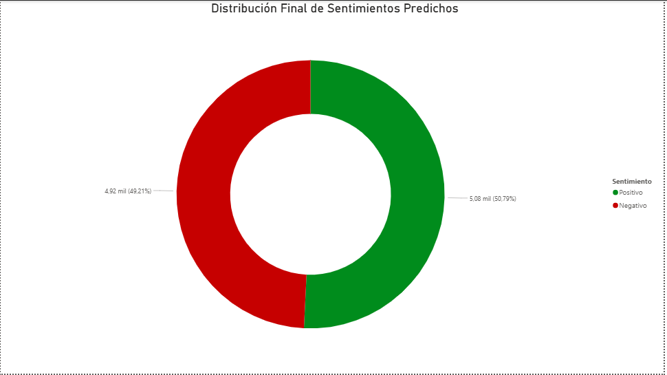
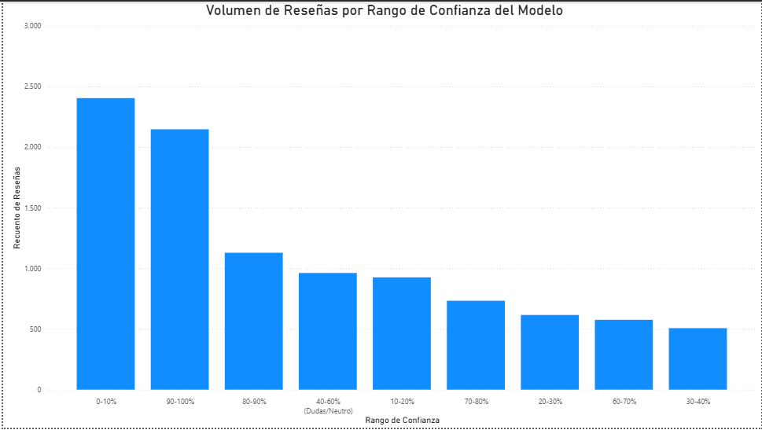
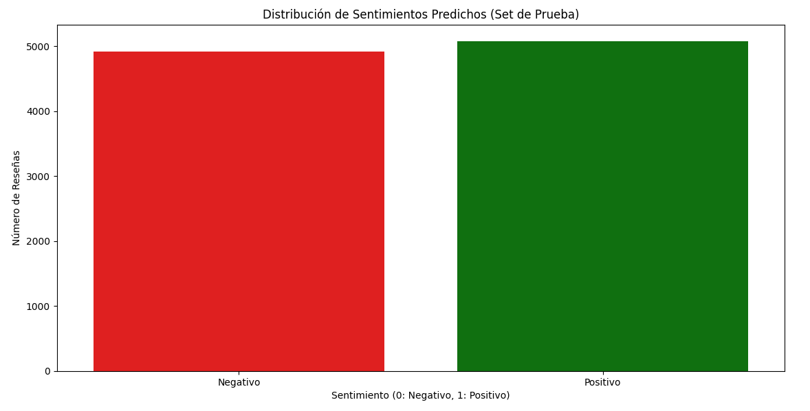

# Proyecto N°11: Análisis de Sentimientos en Reseñas de Películas (IMDB)

## Objetivos y Resumen Ejecutivo

Este proyecto implementa una solución completa de **Machine Learning (ML)** y **Procesamiento de Lenguaje Natural (NLP)** sobre 50,000 reseñas de películas. El objetivo fue construir un clasificador robusto (**Regresión Logística** con **Tf-idf**), asegurar la persistencia de los resultados en **PostgreSQL** y validar el rendimiento del modelo mediante la visualización de la distribución y la confianza de las predicciones en **Power BI**.

| Métrica | Valor Clave |
| :--- | :--- |
| **Dataset Base** | 50,000 Reseñas (IMDB) |
| **Modelo Principal**| Regresión Logística |
| **Balance de Salida** | 49,2% Positivo / 50,8% Negativo |
| **Persistencia** | PostgreSQL (Tabla `resultados_prediccion`) |

## Tecnologías Utilizadas

* **Lenguajes:** Python (versión 3.x), SQL (PostgreSQL).
* **Librerías ML/NLP:** Scikit-learn (Regresión Logística, Tf-idf), NLTK, Pandas, NumPy.
* **Base de Datos:** PostgreSQL (`psycopg2`).
* **Visualización:** Matplotlib, Seaborn, y **Power BI**.
* **Seguridad:** Uso de **`config.py`** para el manejo seguro de credenciales de BD.

## Resultados Clave y Visualizaciones

### Gráficos Ejecutivos (Power BI)

#### Distribución Final de Sentimientos Predichos

* **Hallazgo:** Muestra un balance perfecto, de aproximadamente **49,2% Positivo / 50,8% Negativo**, confirmando la solidez del modelo al mantener la distribución del dataset original.

#### Volumen de Reseñas por Rango de Confianza

* **Hallazgo Clave:** El volumen se concentra en los extremos (alta confianza), con una baja representación en el rango central (40-60%). Esto indica que el modelo es **altamente decisivo** y encuentra pocas reseñas ambiguas.
* **Nota Técnica:** Se implementó la función DAX `VALUE()` para resolver el problema de tipo de dato (Texto a Número) en la columna calculada `Rango_Confianza`.

### Gráficos de Validación (Matplotlib)

* **Matriz de Confusión:** Valida la precisión del modelo al comparar aciertos (True Positives, True Negatives) y errores (False Positives, False Negatives).

* **Distribución de Sentimientos:** Muestra el conteo de predicciones 0 (Negativo) y 1 (Positivo).

## Procedimiento y Metodología

1.  **Limpieza (NLP):** El script `sentimientos.py` utiliza la función `limpiar_texto` para la remoción de etiquetas HTML, *stopwords* y puntuación, esencial para la calidad del análisis de texto.
2.  **Vectorización:** El texto limpio se transforma en características numéricas mediante el **Tf-idf Vectorizer**.
3.  **Modelado:** Se utiliza la **Regresión Logística** para la clasificación binaria de sentimientos.
4.  **Persistencia:** La función `insertar_resultados()` guarda el `Texto_Original`, el `Sentimiento_Predicho` y la `Probabilidad_Positiva` en la tabla **`resultados_prediccion`** de PostgreSQL, utilizando los parámetros de **`config.py`** de forma segura.

## Estructura del Proyecto

La carpeta `proyecto11_sentimientos_peliculas` contiene los siguientes archivos:

| Archivo/Carpeta | Propósito | Notas de Ingeniería de Datos |
| :--- | :--- | :--- |
| `sentimientos.py` | Código fuente principal. | Implementa el flujo ETL y el entrenamiento del modelo. |
| `config.py` | Configuración de la BD. | **EXCLUIDO** en `.gitignore` por seguridad. |
| `IMDB_Dataset.csv` | Dataset Original. | **EXCLUIDO**. |
| `sentimientos_predichos_bi.csv`| Datos de Salida. | **EXCLUIDO**. |
| `assets/` | Gráficos y Esquemas. | Contiene todos los archivos `.png` (Matplotlib, DBeaver, Power BI). |
| `.gitignore` | Control de Versiones. | **Excluye** `config.py` y archivos de formato .csv. |

## Conclusiones

El Proyecto N°11 fue un éxito en la implementación completa de un flujo de trabajo de Ciencia de Datos:

1.  **Seguridad:** Se garantiza la seguridad de las credenciales de PostgreSQL mediante el uso de `config.py`.
2.  **Rendimiento del Modelo:** Los gráficos de confianza en Power BI confirman que el modelo es altamente predictivo y decisivo.
3.  **Integración:** Se demostró la capacidad de llevar los resultados del Machine Learning a una base de datos relacional y, posteriormente, a una herramienta de Business Intelligence para el análisis ejecutivo.

## Citación

**Citación del Proyecto N°11 (Sentimientos de Reseñas de Películas)**

* **Dataset:** IMDB Movie Reviews
* **Fuente:** El dataset fue descargado de: [https://www.kaggle.com/datasets/vishakhdapat/imdb-movie-reviews](https://www.kaggle.com/datasets/vishakhdapat/imdb-movie-reviews)
* **Licencia:** MIT.
