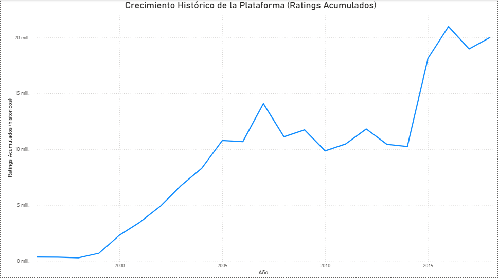
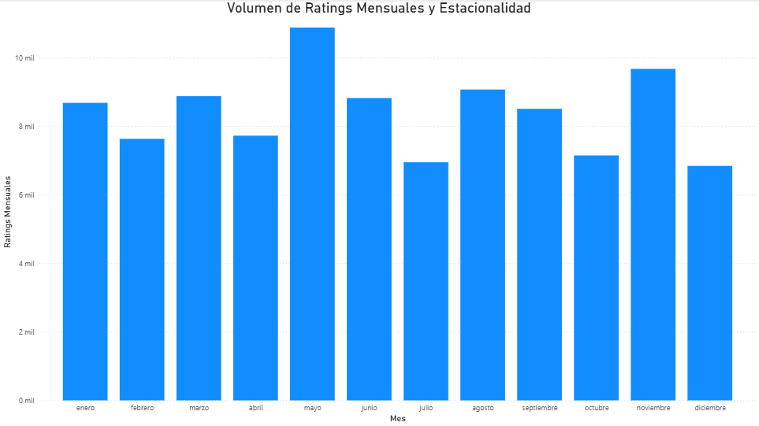

# Proyecto N°7: Análisis de Series de Tiempo y Tendencias (MovieLens)

## Objetivo del Proyecto
El objetivo principal de este proyecto es analizar la base de datos **`movielens_db`** para extraer métricas de **Series de Tiempo y Tendencias**. El proyecto valida la capacidad de construir una solución de **Data Pipeline** (SQL Avanzado → ETL con Python → Visualización con Power BI) para generar inteligencia de negocio sobre el comportamiento del usuario.

---

## Arquitectura y Metodología (SQL y ETL)

La información fue extraída de la tabla `ratings` (PostgreSQL) y transformada en métricas clave para el análisis temporal.

### Código SQL y Funciones de Ventana
La complejidad analítica reside en el SQL:
* **`Agregacion_Datos_Proyecto7.sql`**: Agregación de datos por mes y cálculo del Rating Promedio.
* **`Tendencias_Acumulativas_Proyecto7.sql`**: Utiliza una **Función de Ventana (`SUM() OVER (...)`)** para calcular el **Total Acumulado (Running Total)** de ratings históricos, una métrica vital para la curva de crecimiento.

### Script de Extracción, Transformación y Carga (ETL)
* **`tendencias_series_tiempo.py`**: Ejecuta la consulta SQL, maneja nulos (`.fillna(0)`), fuerza el tipo de dato **float** para evitar problemas de escala en la exportación, y guarda el resultado en **`tendencias_series_tiempo.csv`**.
* **Seguridad:** Las credenciales de la base de datos se gestionan con el archivo **`config.py`**, asegurando que no se expongan datos sensibles en el código principal.

---

## Visualización y Conclusiones (Power BI)

El archivo `tendencias_series_tiempo.csv` se importó en Power BI para crear un dashboard ejecutivo que revele los patrones clave:

### Curva de Crecimiento Histórico (Ratings Acumulados)
Esta visualización de línea muestra la trayectoria de crecimiento total de la plataforma a lo largo de los años. Es la métrica principal para evaluar la madurez de la base de datos.



* **Análisis:** La curva presenta una fase de rápido crecimiento inicial seguida de una estabilización a medida que el proyecto madura, para despegar nuevamente alrededor del año 2015.

### Patrón de Estacionalidad Anual
Este gráfico de columnas analiza el comportamiento interanual, promediando la actividad de todos los eneros, febreros, etc.



* **Análisis:** Permite identificar los meses pico de actividad. Podemos observar que los meses de mayo y noviembre presentan valores más altos, mientras que el mes de julio presenta los valores más bajos en promedio.

---

## Estructura del Repositorio

```

proyecto_07_analisis_series_tiempo/
├── assets/
│   ├── curva_crecimiento.png               # Gráfico 1: Crecimiento Acumulado
│   └── estacionalidad_mensual.png          # Gráfico 2: Estacionalidad Interanual
├── config.py                               # Credenciales DB (IGNORAR EN GIT)
├── Agregacion_Datos_Proyecto7.sql          # SQL Agregación Temporal
├── Tendencias_Acumulativas_Proyecto7.sql   # SQL con Función de Ventana
├── tendencias_series_tiempo.csv            # Resultado ETL (Input para Power BI)
├── tendencias_series_tiempo.py             # Script ETL en Python
└── README.md                               # Documentación del proyecto

````

---

## Citación del Dataset

El *dataset* utilizado para este proyecto es el conjunto de datos **MovieLens**.

F. Maxwell Harper and Joseph A. Konstan. 2015. The MovieLens Datasets: History and Context. ACM Transactions on Interactive Intelligent Systems (TiiS) 5, 4: 19:1–19:19. https://doi.org/10.1145/2827872.

Descargado de https://grouplens.org/datasets/movielens/latest/