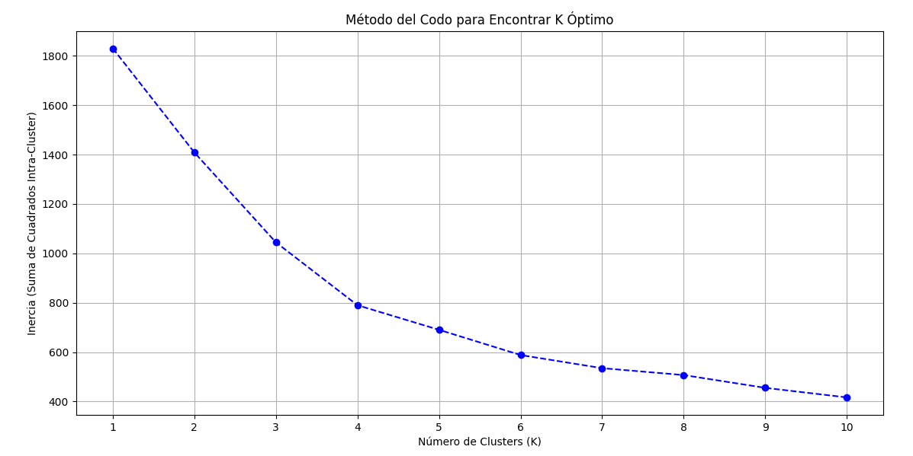

# Proyecto N°8: Análisis de Segmentación y Clustering (K-Means)

## Objetivo del Proyecto
Aplicación de **Clustering K-Means** sobre métricas **RFM** (Recencia, Frecuencia, Rating Promedio) para segmentar la base de usuarios de MovieLens, identificando cuatro perfiles de clientes accionables para estrategias de negocio específicas.

---

## Arquitectura de Data Science

### ETL y Feature Engineering (segmentacion.py)
* **Métricas Clave:** Frecuencia, Rating Promedio y Recencia (calculada a partir de la fecha máxima de rating).
* **Seguridad:** Uso de **`config.py`** para la gestión segura de credenciales.

### Análisis Exploratorio de Datos (EDA)
El EDA confirmó distribuciones **altamente sesgadas** en Frecuencia y Recencia, justificando la necesidad de transformación logarítmica.

* **Visualización:** Histograma de Distribuciones (`eda_segmentacion.py`).


### Machine Learning (transformacion_datos.py)
El clustering se realizó sobre datos transformados (Logarítmicos y Estandarizados).

* **Elección de K:** El **Método del Codo** validó la elección de **K=4** como el punto óptimo para el clustering.



* **Resultado:** El script exportó **`segmentacion_final_para_bi.csv`** con la etiqueta de `Cluster` para cada usuario.

---

## Visualización Ejecutiva (Power BI)

La narrativa de Power BI se centra en la distribución de la base de usuarios y la validación visual del modelo de segmentación.

### Gráfico 1: Distribución de Segmentos (Cuantificación)

* **Título:** **Tamaño de los Segmentos de Clientes para la Estrategia**
* **Visual:** Gráfico de Anillo (Donut Chart).


### Gráfico 2: Separación y Perfil Estratégico (Validación)

* **Título:** **Ubicación de Segmentos Estratégicos (VIPs y Dormidos)**
* **Visual:** Gráfico de Dispersión (Scatter Plot).
* **Análisis Clave:** La **clara separación de los cuatro grupos** de puntos valida la calidad del clustering.


---

## Estructura del Repositorio

```

proyecto_08_segmentacion_usuarios/
├── assets/
│   ├── distribucion_eda.png            # Histograma de distribuciones (EDA)
│   ├── metodo_codo.png                 # Gráfico del Método del Codo (ML)
│   ├── distribucion_powerbi.png        # Gráfico (Anillo)
│   └── separacion_clusters_powerbi.png # Gráfico (Dispersión)
├── config.py                           # Credenciales DB (Buenas Prácticas) IGNORADO
├── segmentacion_usuarios.csv           # Output de SQL (Datos limpios) IGNORADO
├── segmentacion_final_para_bi.csv      # Output de ML (Con columna 'Cluster'), IGNORADO
├── segmentacion.py                     # ETL: SQL y Feature Engineering
├── eda_segmentacion.py                 # EDA: Visualización del sesgo
├── .gitignore                          # IGNORAMOS el archivo config.py y los archivos CSV
├── transformacion_datos.py             # ML: Log, Scaling, K-Means (K=4)
└── README.md                           # Documentación final

````

---
## Conclusiones

El análisis ha segmentado exitosamente a los usuarios en cuatro grupos con identidades de comportamiento claras. El **Gráfico de Dispersión** demuestra que los segmentos más críticos para el negocio (VIP y Dormido) se encuentran en cuadrantes bien diferenciados, permitiendo una acción de marketing precisa:
1.  **Retención:** Estrategias dirigidas al **Cluster VIP** (Cluster 1) para asegurar su lealtad y maximizar su valor a largo plazo.
2.  **Reactivación:** Campañas específicas para el **Cluster Dormido** (Cluster 0) con el objetivo de reducir la tasa de abandono.

---

## Citación del Dataset

El *dataset* utilizado para este proyecto es el conjunto de datos **MovieLens**.

F. Maxwell Harper and Joseph A. Konstan. 2015. The MovieLens Datasets: History and Context. ACM Transactions on Interactive Intelligent Systems (TiiS) 5, 4: 19:1–19:19. https://doi.org/10.1145/2827872.

Descargado de https://grouplens.org/datasets/movielens/latest/

---